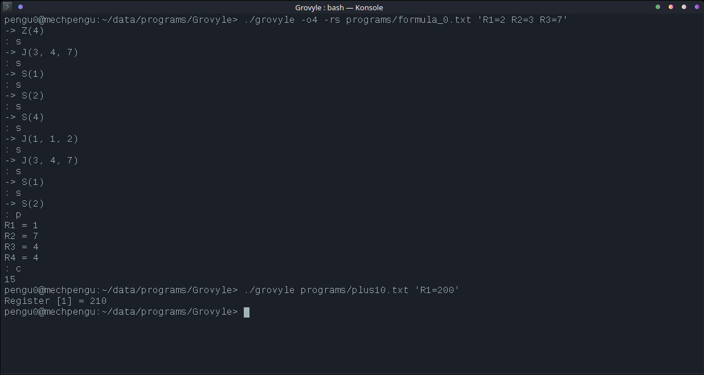

# Grovyle - URM simulator

## Description

This is a software that simulates "unlimited register machine".
The software itself doesn't have unlimited reigsters (that's impossible).

## Simulation limitations

* The highest register index is defined in C source (`#define REGISTER_AMOUNT (1u << 8)`).
* All register values are stored as an unsigned 64 bit value (`uint64_t`).

## Features

### Manual execution

The optional parameter `-s` allows the user to manually call the next instruction and check the values of every used register.

The full list of commands:

* `s` next instruction;
* `c` run the program to the end;
* `p` print all used registers;
* `q` quit the program immediately.

### Initial state

The initial state of the registers in the simulated machine can be given right after the file containing the program instructions.

The expected format of the initial state is `Rn = x`, where `n` is the register number (1 .. `REGISTER_AMOUNT-1`) and `x` is the value (64 bit).

Example: Set register 1 to 5 and register 2 to 10 `./grovyle program.txt 'R1=5 R2=10'`

## Example usage

This example uses the program `formula_0`, stored in `./programs` directory.
The output is looked at register number 4 (`-o4`). At the end, only the result
should be printed (`-r`), and we are allowed to intervene in the execution of the program (`-s`).

```
$ ./grovyle -o4 -rs programs/formula_0.txt 'R1=2 R2=3 R3=7'
-> Z(4)
: s
-> J(3, 4, 7)
: s
-> S(1)
: s
-> S(2)
: s
-> S(4)
: s
-> J(1, 1, 2)
: s
-> J(3, 4, 7)
: s
-> S(1)
: s
-> S(2)
: p
R1 = 1
R2 = 7
R3 = 4
R4 = 4
: c
15
```

## Screenshots

